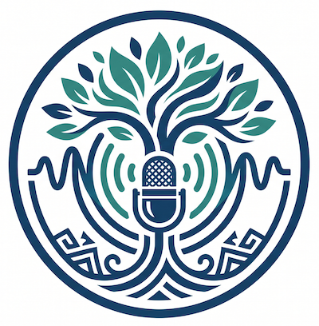

# Audio Recording for Language Revitalization

- Pre-workshop activities: 10 min 
- Introductory presentation: 10 min
- Hands-on activities: 50-80 min

High quality audio recording makes a huge difference in the quality and usability of language learning games as well as Elders' oral stories. There any many ways to record audio, however in this workshop we will demonstrate how you can use relatively low cost wireless microphones with your smartphone to record high quality. The microphone system that we are using, is the [DJI Mic Mini](https://www.dji.com/ca/products/handheld-imaging-devices#mic-series){:target="_blank"} series of microphones. 

If you are participating in an person workshops, the DSC provides sets of Mic Mini's for participants to practice with. You can also borrow DJI Mic Mini's from the [UVic Libraries Ask Us Desk](https://www.uvic.ca/library/visit-and-contact/ask-us/index.php){:target="_blank"} (starting at the end of September 2026) which is physically located on the main floor of the library not far from the front door.

## Learning objectives

At the end of this workshop, you will be able to:

1. **Audio Recording Equipment Setup**: Will correctly connect the DJI Mic Mini hardware to an iOS device or Android and verify the active connection using the capsule scratch test with 100% accuracy.
2. **Gain Calibration**: Using the DJI Mimo app, participants will adjust the physical gain dial on the receiver so that practice voice peaks consistently remain within two-thirds to three-quarters of the visual audio meter, avoiding clipping (red zone) across all spoken letters.
3. **Audio Recording**: Following the provided workflow, participants will record a distinct audio memo for each letter of a target alphabet, maintaining a 15–20 cm mic distance and leaving a half-second silent buffer before and after each sound.
4. **File Naming & Formatting**: Rename each recorded audio file in Voice Memos using plain-text, lowercase, web-safe naming conventions (e.g., c_glottal instead of apostrophes or special characters) that correspond to their alphabet list.
5. **Post-Recording Trimming & Export**: Using the built-in iOS Voice Memos edit tools, participants will trim audio files to retain roughly a quarter-second of silence surrounding each letter sound and export the complete set of .m4a files via AirDrop or cloud storage for integration into a language learning application.
6. **Pre-Elder Interview & Informed Consent Protocols**: Participants will conduct a pre-session interview with the speaker to document explicit permissions, confirm preferred spellings and cultural names, establishing clear protocols regarding who may access, listen to, or publish the audio files.
7. **Monitoring & Managing Audio Recording**: During longer storytelling sessions, participants will monitor audio levels to maintain signal peaks between -18 dB and -6 dB (or two-thirds to three-quarters on a visual meter) without clipping, adjusting mic placement or receiver gain to accommodate natural volume variations in spoken dialogue.
8. **Archival File Packaging & Metadata**: By the end of the activity, participants will trim, export, and package the primary session recording alongside an unedited master copy, labeling all files using web-safe, standardized file-naming conventions (YYYYMMDD_speakername_topic.m4a) and pairing them with a text metadata record.
 
[NEXT STEP: Pre-Workshop Activities](pre-workshop.html){: .btn .btn-blue }
